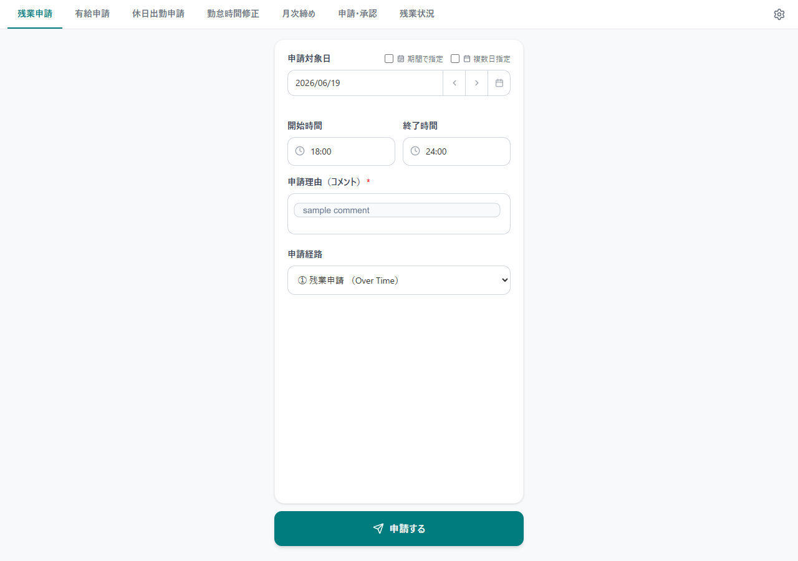
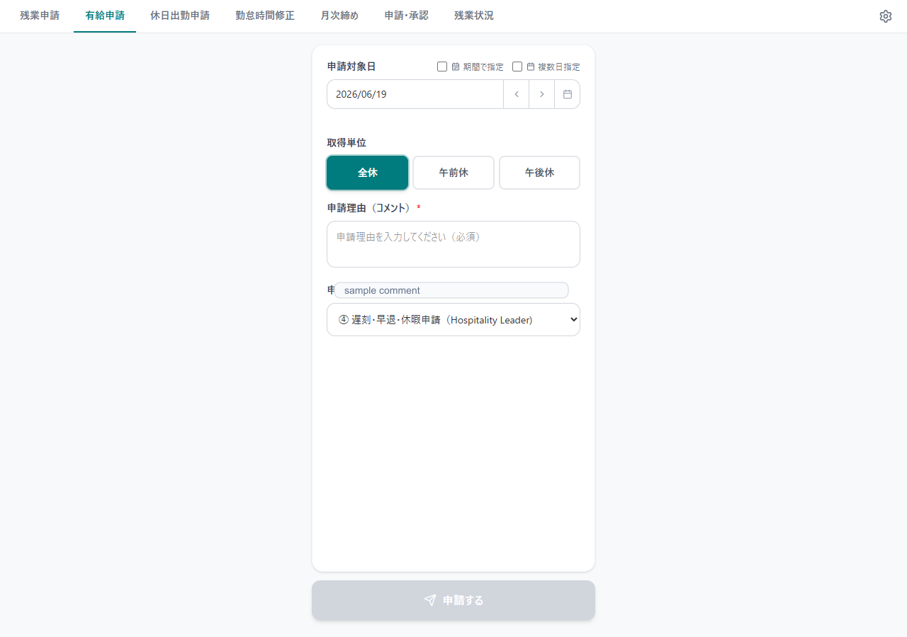
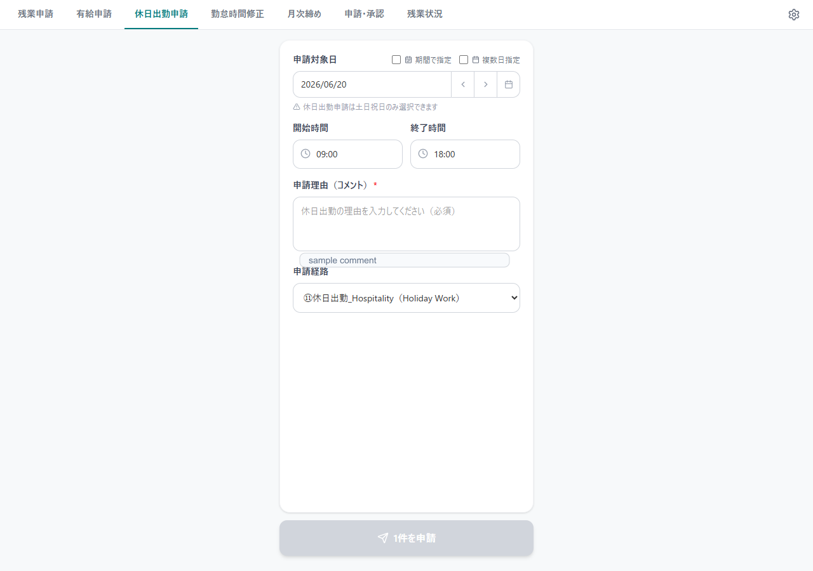
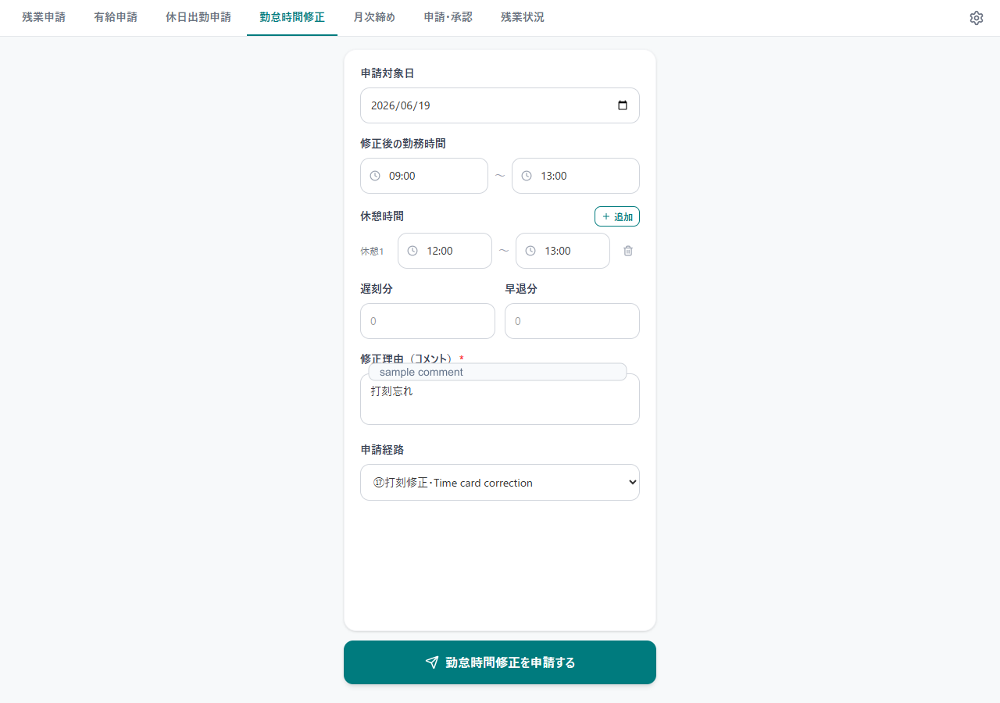
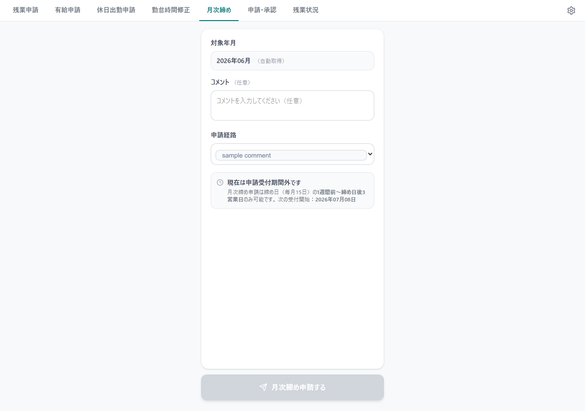
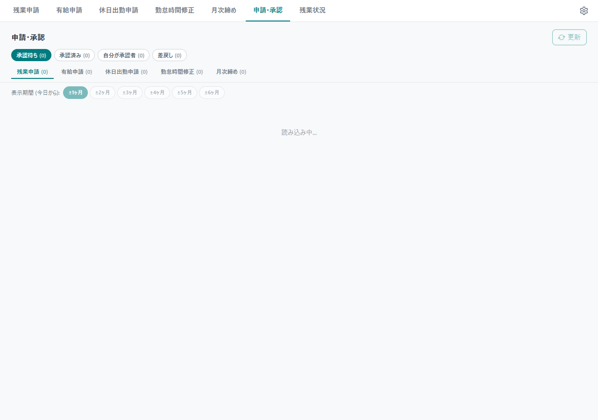
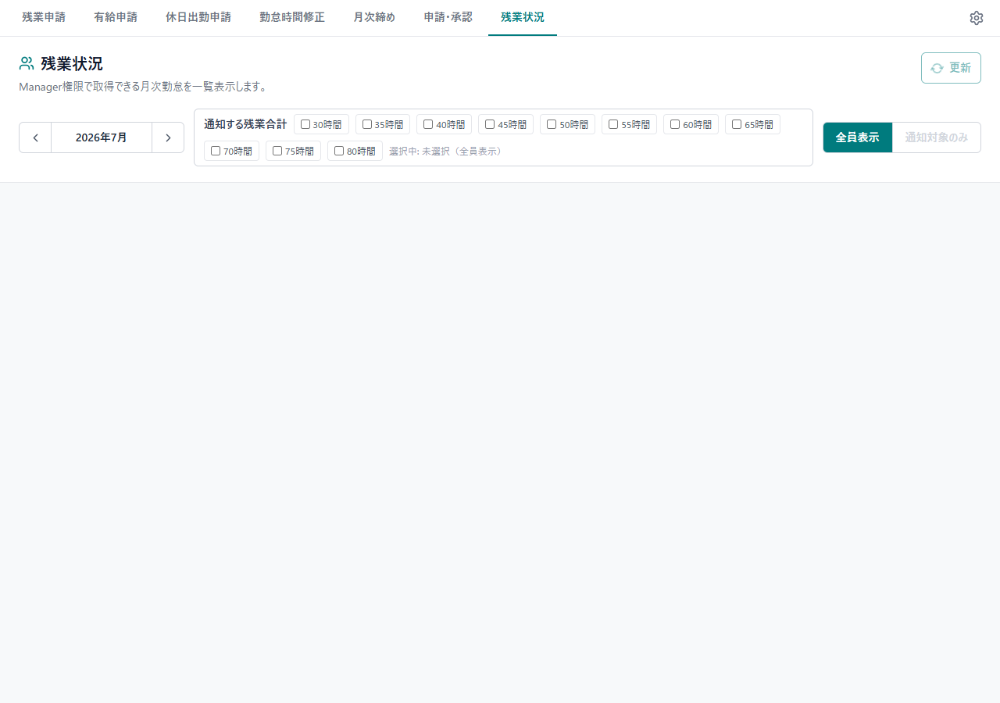
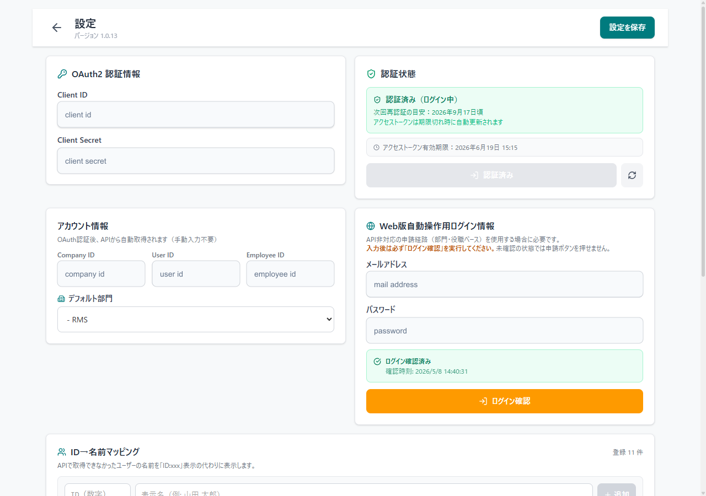

# freee申請ツール ユーザーマニュアル

対象バージョン: 1.0.13

このツールは、freee人事労務の残業申請、有給申請、休日出勤申請、勤怠時間修正、月次締め、申請承認、残業状況確認をまとめて行うためのデスクトップアプリです。

## 共通操作

- 画面上部のタブで機能を切り替えます。
- 右上の歯車アイコンから設定画面を開きます。
- 申請経路はfreee側の承認経路を取得して表示します。
- APIで申請できるものはAPIで送信します。API制限がある経路や項目は、Web版freeeをバックグラウンドで操作して申請します。
- 期間指定は開始日から終了日までをまとめて申請します。
- 複数日指定はカレンダー上の日付をクリックして追加・解除します。

## 残業申請

残業申請タブでは、対象日、開始時間、終了時間、申請理由、申請経路を指定して残業申請を送信します。

主な項目:

- `申請対象日`: 単日、期間指定、複数日指定を切り替えられます。
- `開始時間` / `終了時間`: 30分単位で選択できます。日付をまたぐ時間も選択できます。
- `申請理由`: freeeへ送信するコメントです。必須です。
- `申請経路`: freeeの承認経路です。前回選択した経路を保持します。

注意事項:

- 経路が部門・役職ベースの場合は、APIではなくWeb経由で申請します。
- 期間指定・複数日指定を使う場合は、同じ開始時間・終了時間・理由・経路で各日付に申請します。
- 残業申請では土日祝日を除外するかどうかを選べます。

## 有給申請

有給申請タブでは、有給の対象日と取得区分を指定して申請します。

主な項目:

- `申請対象日`: 単日、期間指定、複数日指定を切り替えられます。
- `取得区分`: 全休、午前休、午後休を選択します。
- `申請理由`: 必要に応じて入力します。
- `申請経路`: freeeの承認経路です。

注意事項:

- 有給申請は土日祝日を除外して扱います。
- 期間指定の場合も、営業日だけを対象にします。
- 部門・役職ベースの経路ではWeb経由で申請する場合があります。

## 休日出勤申請

休日出勤申請タブでは、土日祝日の勤務予定を申請します。

主な項目:

- `申請対象日`: 土日祝日のみ選択できます。
- `期間で指定`: 休日だけを抽出してまとめて申請します。
- `複数日指定`: カレンダー上で休日をクリックして追加・解除します。
- `勤務予定時間`: 休日出勤予定の開始・終了時間です。
- `申請理由`: 必須です。
- `申請経路`: 休日出勤用の承認経路を選択します。

注意事項:

- 平日は選択できません。
- 複数日指定では、カレンダーでクリックした日付がその場で選択状態になります。もう一度クリックすると解除されます。
- 休日出勤申請はAPIで送れる場合はAPIを使い、必要に応じてWeb経由に切り替えます。

## 勤怠時間修正

勤怠時間修正タブでは、対象日の出勤・退勤時刻、休憩時間、遅刻・早退時間を申請します。

主な項目:

- `申請対象日`: 修正したい日付です。
- `修正後の勤務時間`: 出勤時刻と退勤時刻です。
- `休憩時間`: 休憩の開始・終了を入力します。追加・削除できます。
- `遅刻分` / `早退分`: 必要な場合だけ分単位で入力します。
- `申請理由`: 必須です。
- `申請経路`: 勤怠修正用の承認経路を選択します。

注意事項:

- 入力した勤務時間と休憩時間がfreeeへ送信されます。
- 自動承認設定の対象にする場合は、申請・承認タブの自動承認設定で経路を許可してください。

## 月次締め

月次締めタブでは、対象月の勤怠締め申請を送信します。

主な項目:

- `対象月`: 締め申請する月です。
- `コメント`: 必要に応じて入力します。
- `申請経路`: 月次締め用の承認経路を選択します。

注意事項:

- 月次締め申請は、締め日付近の申請可能期間だけ送信できます。
- APIで送信できない経路はWeb経由で申請します。

## 申請・承認

申請・承認タブでは、自分が承認する申請と、自分が出した申請を確認・操作します。

上部フィルター:

- `承認待ち`: 承認対象の申請を表示します。
- `承認済み`: 承認済みの申請を表示します。
- `自分が承認者`: 自分が承認者として関係する申請を表示します。
- `差戻し`: 差戻し済みの申請を表示します。

申請種別タブ:

- `残業申請`
- `有給申請`
- `休日出勤申請`
- `勤怠時間修正`
- `月次締め`

できること:

- 申請内容の確認
- 一括承認
- 一括差戻し
- 自分が出した申請の取り下げ・削除
- 自動承認の時間設定
- 自動承認の経路設定

注意事項:

- 一括承認・差戻しはfreee Web画面の自動操作を使う場合があります。
- Web操作が必要な機能を使う前に、設定画面でメールアドレス・パスワードを入力し、ログイン確認を完了してください。
- 自分の申請の一括削除は、APIで処理できるものを優先し、必要なものだけWeb操作へ切り替えます。

## 残業状況

残業状況タブでは、Manager権限で取得できるメンバーの月次勤怠集計を確認します。

主な項目:

- `対象月`: 表示する勤怠月です。
- `通知する残業合計`: 通知対象とする残業時間のしきい値です。
- `表示対象`: 全員表示、またはしきい値超過者のみ表示します。
- `従業員一覧`: 法定内残業、時間外労働、法定休日労働、深夜労働、残業合計などを表示します。

残業合計の考え方:

- `時間外労働 + 法定休日労働 + 深夜労働` を残業合計として表示します。
- 法定内残業は残業合計には含めません。

注意事項:

- Manager権限がない場合、このタブは表示されない、またはデータ取得できない場合があります。
- チェックボックスの切り替えだけでは再取得せず、表示済みデータをもとに絞り込みます。
- 月を変更した場合やタブを開き直した場合に最新データを取得します。

## 設定

設定画面では、freee API認証、Web自動操作用ログイン情報、デフォルト部門、ID名マッピングなどを設定します。

主な項目:

- `OAuth2 認証情報`: freee APIで利用するClient ID / Client Secretです。
- `認証状態`: OAuth認証の状態とアクセストークン有効期限を確認します。
- `アカウント情報`: Company ID、User ID、Employee IDを表示します。OAuth認証後に自動取得されます。
- `デフォルト部門`: 部門指定が必要な申請で使用します。
- `Web版自動操作用ログイン情報`: API非対応の申請や承認操作で使います。
- `ログイン確認`: Web操作用ログイン情報でfreeeへログインできるか確認します。
- `ID→名前マッピング`: APIで名前が取れないユーザーIDを表示名に置き換えます。

注意事項:

- Client Secret、パスワード、メールアドレスは慎重に管理してください。
- Web操作を使う申請・承認では、ログイン確認済みである必要があります。
- 設定を変更したら、右上の `設定を保存` を押してください。
